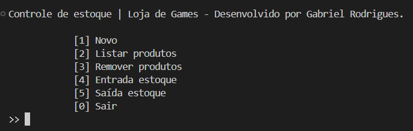

# 📦 PTI - Algoritmos e Programação II | Controle de Estoque

**Tema:** Software para Controle de estoque

## 📝 Objetivo
Desenvolver um protótipo de *software* em **C#** que gerenciará o estoque de produtos de uma loja de games. Nesse protótipo ainda não irá se conectar ao banco de dados. As informações ficarão em memória, assim, serão perdidas ao reiniciar o programa.

### Lógica implementada
Escolhi o ramo de games para representar esse cliente e definir a estrutura da classe que representará o produto. Acrescentei 3 atributos além do que foi requisitado pelo trabalho da faculdade. A quantidade de estoque de cada produto registrado começará em zero.

## 👨‍💻 Iniciando o programa
1) Baixe o arquivo zipado e extraia em um lugar de sua preferência.
2) Abra a pasta extraída em sua *IDE* de preferência.
3) Abra o terminal e digite:
> dotnet run
4) Experiemente registrar produtos, alimentar o estoque e simular vendas, onde o estoque diminui.

## 📌 Saída
